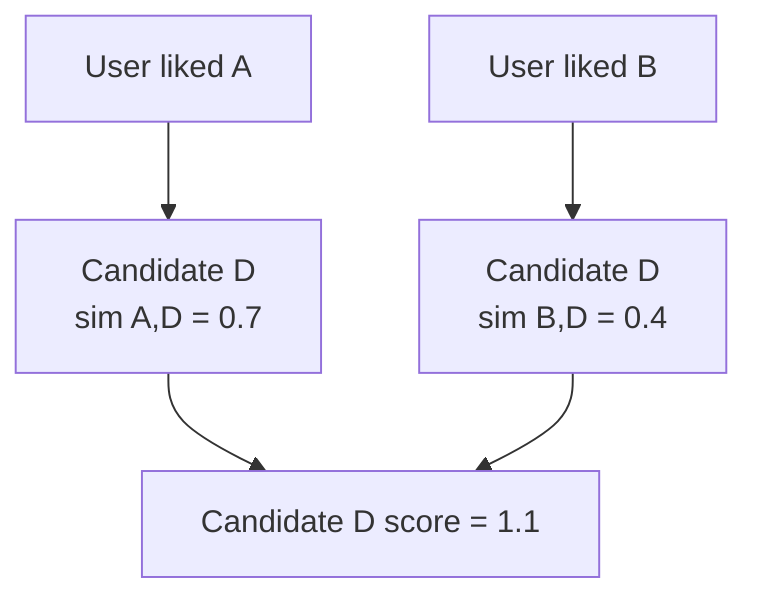

# Item-CF

Item-CF recommends items similar to the items a user already liked.

The idea came from a practical weakness of User-CF. Users can be noisy and change over time, but item relationships are often more stable. If many people who liked `The Matrix` also liked another movie, that second movie becomes a reasonable candidate.

On MovieLens, build a movie-movie similarity matrix from user ratings. A simple first version can keep only positive ratings, such as ratings greater than or equal to 4.0, then compute cosine similarity between movie columns.

The first implementation should:

1. Load `ratings.csv`.
2. Build a sparse user-movie matrix.
3. Compute top similar movies for each movie.
4. For one user, collect movies similar to the user's liked movies.
5. Filter movies the user has already rated.

Item-CF is worth writing first because the output is easy to inspect. If a movie is recommended, you can trace it back to the movie that triggered it.

## Why recommend by item first

User-CF looks for similar users. That sounds natural, but it is often unstable in practice.

First, users are sparse. Two users may share only one or two rated movies, so their similarity score can be based on very little evidence.

Second, user taste changes. A person who loved action movies in college may later watch mostly documentaries. If you mix all history together, the nearest users can become noisy.

Third, item relationships are easier to precompute. The movie catalog changes more slowly than user behavior, so movie-movie neighbors can be built offline and reused at recommendation time.

Item-CF moves the main work to item relationships: "given movies this user liked, which other movies are similar?"


## How one MovieLens sample enters Item-CF

Suppose the data has a few ratings:

| userId | movieId | rating |
| --- | --- | --- |
| 1 | A | 5.0 |
| 1 | B | 4.5 |
| 2 | A | 4.0 |
| 2 | C | 4.5 |
| 3 | B | 5.0 |
| 3 | C | 4.0 |

If ratings greater than or equal to 4.0 mean "liked", the user-item table becomes:

| User | A | B | C |
| --- | --- | --- | --- |
| 1 | 1 | 1 | 0 |
| 2 | 1 | 0 | 1 |
| 3 | 0 | 1 | 1 |

Movie A and B are connected because user 1 liked both. Movie A and C are connected because user 2 liked both. Movie B and C are connected because user 3 liked both. In the real dataset, the same idea scales to many users and many movies.

## Similarity

The first version can use cosine similarity. Treat each movie as a long vector over users. If a user liked the movie, the value is 1. If not, the value is 0.

```text
similarity(A, B) = dot(A, B) / (norm(A) * norm(B))
```

The intuition is simple: more overlapping fans means higher similarity. The denominator also prevents very popular movies from becoming similar to everything only because everyone watched them.

## Recommendation score

For a target user, each liked movie brings back similar movies. A candidate movie gets points from every liked movie that supports it.



You can also weight by the user's original rating, but the first version should stay simple.

## Small hand-worked example

The target user liked:

| Liked movie | Rating |
| --- | --- |
| The Matrix | 5.0 |
| Inception | 4.5 |

Offline movie similarities:

| Source movie | Similar movie | Similarity |
| --- | --- | --- |
| The Matrix | Blade Runner | 0.82 |
| The Matrix | John Wick | 0.63 |
| Inception | Interstellar | 0.79 |
| Inception | Blade Runner | 0.40 |

Candidate scores:

| Candidate | Supported by | Score |
| --- | --- | --- |
| Blade Runner | The Matrix, Inception | 0.82 + 0.40 = 1.22 |
| Interstellar | Inception | 0.79 |
| John Wick | The Matrix | 0.63 |

The recommendation order is Blade Runner, Interstellar, then John Wick. Blade Runner wins because two liked movies support it, not because it has the single highest pairwise similarity.

If the user already rated Blade Runner, filter it out. Recommending something the user has already consumed is usually not useful.

## Run

From the repository root:

```bash
./01-traditional-statistics/item-cf/run.sh --sample-ratings 2000000
```

Use more data or the full dataset when needed:

```bash
./01-traditional-statistics/item-cf/run.sh --sample-ratings 5000000
./01-traditional-statistics/item-cf/run.sh --sample-ratings none
```

The script writes `report.md` and `report.zh.md` in this directory.

## Common mistakes

Do not treat missing ratings as dislikes. In MovieLens, a missing rating usually means unknown, not negative.

Watch out for popularity bias. Very popular movies can become connected to many other movies. Keeping only the top K neighbors per movie helps.

Always filter already rated movies. Otherwise the recommendation list may look good in a metric but feel wrong to a real user.

## You should be able to answer

- Why can Item-CF be easier to precompute than User-CF?
- Why is a missing MovieLens rating not the same as a dislike?
- What exactly does cosine similarity compare here?
- Why should already rated movies be filtered?
