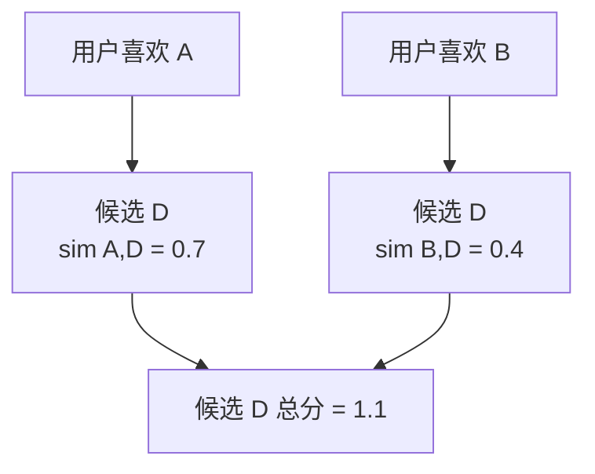

# Item-CF

Item-CF 根据用户喜欢过的电影，推荐相似电影。

它出现得很早，也很实用。User-CF 要找相似用户，但用户兴趣会变，行为也更稀疏。电影之间的关系通常更稳定一些。如果很多喜欢《黑客帝国》的人也喜欢另一部电影，那另一部电影就可以成为候选。

先别急着把它想成公式。Item-CF 的直觉很像逛视频网站时看到的“看过这部的人也看了”。它不关心你是谁，也不关心电影简介写了什么。它只看行为：哪些电影经常被同一批用户喜欢。


在 MovieLens 上，可以先用评分构建电影和电影的相似度矩阵。第一版不用复杂，把评分大于等于 4.0 当作喜欢，然后对电影列向量算余弦相似度。

## 它为什么先推荐电影，而不是先找人

User-CF 的想法是找相似用户。听起来很自然，但实际会遇到几个麻烦。

第一，用户很多，而且每个用户看过的电影很少。两个用户之间可能根本没有多少共同电影，算出来的相似度很不稳定。

第二，用户兴趣会变。一个人大学时喜欢动作片，几年后可能更喜欢纪录片。你把他的所有历史混在一起算相似用户，结果可能很乱。

第三，线上系统里用户变化比电影变化更快。每天都有新用户、新行为，但电影库变化相对慢一些。电影之间的相似关系可以提前算好，推荐时查表就行。

Item-CF 的好处就在这里：它把主要计算放到“电影和电影之间的关系”上。

## MovieLens 上的一条样本怎么进入 Item-CF

假设有几条评分：

| userId | movieId | rating |
| --- | --- | --- |
| 1 | A | 5.0 |
| 1 | B | 4.5 |
| 2 | A | 4.0 |
| 2 | C | 4.5 |
| 3 | B | 5.0 |
| 3 | C | 4.0 |

如果把 4.0 以上都当成喜欢，就能得到一张用户-电影表：

| 用户 | A | B | C |
| --- | --- | --- | --- |
| 1 | 1 | 1 | 0 |
| 2 | 1 | 0 | 1 |
| 3 | 0 | 1 | 1 |

现在看电影 A 和 B：用户 1 同时喜欢它们，所以它们有关系。电影 A 和 C：用户 2 同时喜欢它们，也有关系。电影 B 和 C：用户 3 同时喜欢它们，也有关系。真实数据里用户和电影更多，相似度就从这些共同喜欢的模式里长出来。

## 相似度到底怎么算

第一版用余弦相似度就够了。把每部电影看成一个很长的向量，向量长度等于用户数。某个用户喜欢这部电影，对应位置就是 1；不喜欢或没记录，就是 0。

两部电影的余弦相似度大，意思是喜欢它们的用户重合比较多。

```text
similarity(A, B) = dot(A, B) / (norm(A) * norm(B))
```

这个公式不用死记。你可以把它理解成：共同喜欢的人越多，相似度越高；但如果一部电影本来就人人都喜欢，分母会把它的影响压一压，避免热门电影把所有东西都连起来。

## 推荐分数怎么来

对一个目标用户，先找出他喜欢过的电影。每部喜欢过的电影都会带出一批相似电影。一个候选电影的最终分数，可以把这些相似度加起来。



如果你还保留原始评分，也可以加权：用户给 5 分的电影，比给 4 分的电影权重大一点。但第一版先别加太多东西，先把最朴素的版本写清楚。

## 手算一个很小的推荐例子

假设目标用户喜欢过两部电影：

| 用户喜欢过 | 用户评分 |
| --- | --- |
| A: The Matrix | 5.0 |
| B: Inception | 4.5 |

离线已经算好了电影相似度：

| 原电影 | 相似电影 | 相似度 |
| --- | --- | --- |
| The Matrix | Blade Runner | 0.82 |
| The Matrix | John Wick | 0.63 |
| Inception | Interstellar | 0.79 |
| Inception | Blade Runner | 0.40 |

现在给候选电影加分：

| 候选电影 | 来自哪部已喜欢电影 | 分数 |
| --- | --- | --- |
| Blade Runner | The Matrix, Inception | 0.82 + 0.40 = 1.22 |
| Interstellar | Inception | 0.79 |
| John Wick | The Matrix | 0.63 |

所以推荐顺序是：

1. Blade Runner
2. Interstellar
3. John Wick

这个例子里，Blade Runner 排第一，不是因为它和某一部电影最像，而是因为它同时被两部用户喜欢过的电影支持。Item-CF 很多时候就是这样工作的：多个弱证据叠在一起，最后变成一个强推荐。

如果目标用户已经看过 Blade Runner，就要把它过滤掉。推荐系统不是考试，不能把答案里已经出现过的东西再交一次。

第一版代码建议这样写：

1. 读取 `ratings.csv`。
2. 构建稀疏的用户-电影矩阵。
3. 为每部电影计算最相似的电影。
4. 对某个用户，把他喜欢过的电影拿出来找相似电影。
5. 过滤掉他已经评分过的电影。

Item-CF 适合第一个写，因为推荐结果容易解释。推荐了哪部电影，通常能追溯到它是被用户喜欢过的哪部电影带出来的。

## 常见坑

最常见的坑是把“没评分”当成“不喜欢”。MovieLens 里用户没给某部电影评分，可能只是没看过，不代表讨厌它。所以第一版做隐式反馈时，通常只把高评分当成正样本，没出现的地方先当未知。

第二个坑是热门电影过强。特别热门的电影会和很多电影都有共同用户，导致推荐列表被大热门占满。后面可以试试惩罚热门电影，或者只保留每部电影最相似的前 K 个邻居。

第三个坑是没有做已看过滤。如果把用户已经评分过的电影又推荐给他，指标可能看起来还行，但真实推荐体验很差。

## 读完应该能回答

- Item-CF 为什么比 User-CF 更适合提前计算？
- 为什么 MovieLens 里的“没评分”不能直接当成“不喜欢”？
- 余弦相似度在这里到底比较的是什么？
- 为什么要过滤用户已经看过的电影？
