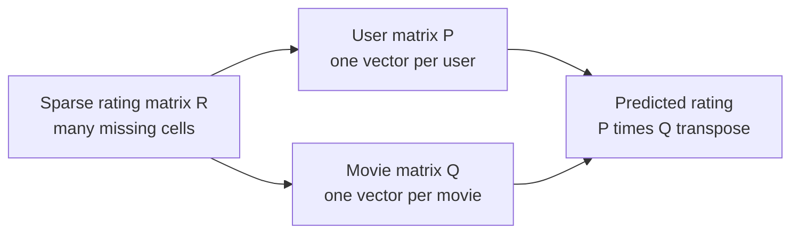
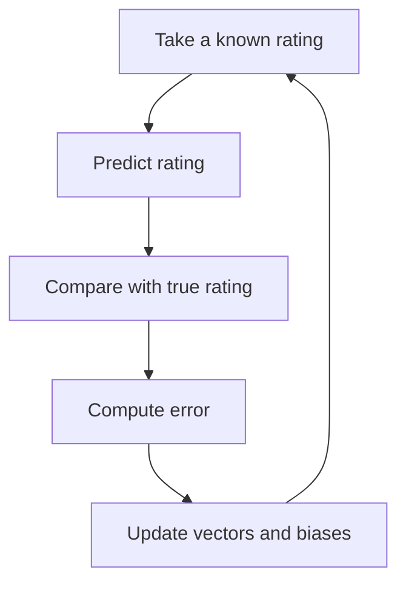

# Matrix factorization

Matrix factorization turns IDs into vectors.

The rating table is mostly empty: most users rated only a tiny fraction of all movies. Matrix factorization assumes the table has hidden low dimensional structure. A user vector might encode taste for action, comedy, old movies, or niche genres. A movie vector lives in the same space. Their dot product becomes the predicted rating.

On MovieLens, the model learns two matrices:

- `P`: one embedding vector per user
- `Q`: one embedding vector per movie

The predicted rating is usually `dot(P[user], Q[movie])`, often with user bias, item bias, and a global mean.

The first implementation can use stochastic gradient descent on known ratings. Print nearest movies in the learned embedding space after training. That check makes the vectors less mysterious.

## Why this is the start of embeddings

Item-CF compares movies through shared users. Matrix factorization goes one step further: it learns a vector for every user and every movie.

That idea matters because many later recommender models still use embeddings. Two tower models, NCF, DeepFM, SASRec, and LightGCN all rely on turning IDs into vectors. Matrix factorization is the simplest place to see that happen.

The dimensions are not manually named. You do not tell the model that dimension 3 means sci-fi and dimension 7 means comedy. The model only learns numbers that reduce prediction error. Some dimensions may become interpretable, but many are mixed signals.



## Why add bias terms

A pure dot product misses simple but strong patterns.

Some users rate generously. Some users are strict. Some movies are broadly liked. Some movies receive lower ratings overall.

A common prediction formula is:

```text
predicted rating = global mean + user bias + movie bias + dot(user vector, movie vector)
```

The bias terms handle broad rating habits. The dot product handles personalized taste.

## What training does

Training is repeated error correction:

1. Pick a known rating, such as user 10 rated movie 50 as 4.5.
2. Predict the rating using the current vectors and biases.
3. Compare prediction with the true rating.
4. Update vectors and biases so the next prediction is closer.



## A two-dimensional toy example

Real embeddings may have 32 or 64 dimensions. To understand the idea, imagine only two:

| Movie | Vector |
| --- | --- |
| The Matrix | `[0.9, 0.1]` |
| John Wick | `[0.8, 0.2]` |
| Toy Story | `[0.1, 0.9]` |
| Finding Nemo | `[0.2, 0.8]` |

Roughly, the first dimension acts like action/sci-fi and the second like animation/family.

| User | Vector |
| --- | --- |
| User A | `[0.85, 0.15]` |
| User B | `[0.15, 0.85]` |

User A with The Matrix:

```text
0.85 * 0.9 + 0.15 * 0.1 = 0.78
```

User A with Toy Story:

```text
0.85 * 0.1 + 0.15 * 0.9 = 0.22
```

So User A is more likely to receive The Matrix or John Wick. User B is more likely to receive Toy Story or Finding Nemo.

## One rating prediction example

Suppose:

```text
global mean = 3.5
User A bias = +0.2
The Matrix bias = +0.4
dot product = 0.78
```

Prediction:

```text
3.5 + 0.2 + 0.4 + 0.78 = 4.88
```

The model expects User A to like The Matrix.

## Run

From the repository root:

```bash
./01-traditional-statistics/matrix-factorization/run.sh --sample-ratings 2000000
```

Use full MovieLens when needed:

```bash
./01-traditional-statistics/matrix-factorization/run.sh --sample-ratings none
```

The script writes `report.md` and `report.zh.md`.

The default maximum is 1000 epochs, but validation RMSE early stopping stops training when the model no longer improves.

To save only the best checkpoint:

```bash
./01-traditional-statistics/matrix-factorization/run.sh --sample-ratings none --save-checkpoints --checkpoint-every 0
```

The generated report records the `.pt` file size. To keep a few intermediate checkpoints too:

```bash
./01-traditional-statistics/matrix-factorization/run.sh --sample-ratings none --save-checkpoints --checkpoint-every 20 --keep-checkpoints 3
```

Use `--no-save-checkpoints` if you do not want any `.pt` writes. `checkpoints/` is ignored by git.

## Common mistakes

Do not treat missing cells as zero ratings. Missing means unknown.

Do not start with a huge embedding dimension. Try 32 or 64 first.

Do not trust training loss alone. Check validation or test error, then inspect nearest movies in embedding space.
