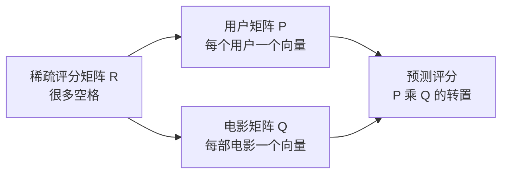
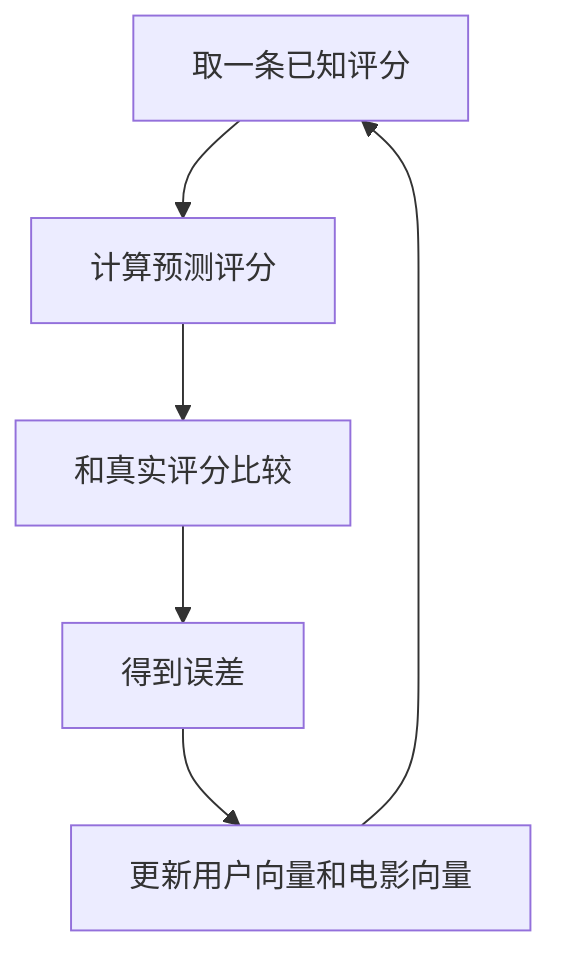

# 矩阵分解

矩阵分解把 ID 变成向量。

用户-电影评分表非常稀疏：大多数用户只给很少一部分电影打过分。矩阵分解的假设是，这张大表背后有一个低维结构。用户向量可能表示他对动作片、喜剧、老电影、小众类型的偏好。电影向量也在同一个空间里。两个向量点积，就得到预测评分。

你可以先把它想成“补表”。MovieLens 的完整评分表应该是每个用户对每部电影都有一个评分，但现实里大部分格子是空的。矩阵分解要做的事，就是根据已经填过的格子，猜那些空格子里可能是什么。



在 MovieLens 上，模型主要学习两个矩阵：

- `P`：每个用户一个 embedding
- `Q`：每部电影一个 embedding

预测评分通常是 `dot(P[user], Q[movie])`，再加上用户偏置、电影偏置和全局平均分。

## 为什么说它是 embedding 的起点

在 Item-CF 里，电影相似度来自共同用户。矩阵分解往前走了一步：它不再只问两部电影有没有共同用户，而是给每个用户和每部电影都学一个向量。

这件事很重要。因为一旦 ID 变成向量，很多后来的模型就能接上来了。双塔模型、NCF、DeepFM、SASRec、LightGCN 都离不开 embedding。矩阵分解是理解这些模型的一块地基。

一个用户向量不是人工写出来的。你没有告诉模型“第 3 维表示科幻偏好，第 7 维表示喜剧偏好”。模型只是在训练中发现：如果把某些用户和某些电影放得更近，评分预测误差会变小。最后这些维度可能对应某些可解释口味，也可能只是混合信号。

## 加偏置是为了什么

只用点积会漏掉一些很普通但很强的规律。

有些用户天生打分高。他可能大部分电影都给 4 分以上。有些用户打分很严格，3.5 分已经算喜欢。电影也一样，有些电影整体评分就高，有些电影整体评分低。

所以常见预测公式会长这样：

```text
预测评分 = 全局平均分 + 用户偏置 + 电影偏置 + 用户向量和电影向量的点积
```

偏置项负责处理“这个用户普遍宽松吗”“这部电影普遍受欢迎吗”。向量点积再负责处理更个性化的部分。

## 训练时发生了什么

第一版可以用随机梯度下降。过程很像反复改答案：

1. 随机拿一条真实评分，比如用户 10 给电影 50 打了 4.5 分。
2. 用当前的用户向量和电影向量预测一个分数。
3. 看预测分数和真实分数差多少。
4. 调整用户向量、电影向量和偏置，让下次预测更接近真实评分。



训练很多轮后，模型会慢慢把喜欢相似电影的用户放到相似位置，也会把被相似用户喜欢的电影放到相似位置。

## 用二维向量看一个玩具例子

真实模型的 embedding 可能有 32 维、64 维，甚至更多。为了看懂，先假设只有 2 维：

| 电影 | 向量 |
| --- | --- |
| The Matrix | `[0.9, 0.1]` |
| John Wick | `[0.8, 0.2]` |
| Toy Story | `[0.1, 0.9]` |
| Finding Nemo | `[0.2, 0.8]` |

这个二维空间可以粗略理解成：

- 第一维高：更像动作、科幻、紧张刺激
- 第二维高：更像动画、家庭、轻松

再看两个用户：

| 用户 | 向量 |
| --- | --- |
| 用户 A | `[0.85, 0.15]` |
| 用户 B | `[0.15, 0.85]` |

用户 A 和 The Matrix 的点积：

```text
0.85 * 0.9 + 0.15 * 0.1 = 0.78
```

用户 A 和 Toy Story 的点积：

```text
0.85 * 0.1 + 0.15 * 0.9 = 0.22
```

所以模型会更倾向于给用户 A 推荐 The Matrix 或 John Wick。用户 B 则更可能被推荐 Toy Story 或 Finding Nemo。

真实训练时，模型不会知道“第一维是动作片，第二维是动画片”。这是我们为了理解做的解释。模型只知道一件事：怎样调整这些数字，能让预测评分更接近真实评分。

## 一个预测评分的例子

假设：

```text
全局平均分 = 3.5
用户 A 偏置 = +0.2
电影 The Matrix 偏置 = +0.4
用户向量和电影向量点积 = 0.78
```

预测评分就是：

```text
3.5 + 0.2 + 0.4 + 0.78 = 4.88
```

这说明模型认为用户 A 很可能喜欢 The Matrix。

如果换成 Toy Story：

```text
全局平均分 = 3.5
用户 A 偏置 = +0.2
电影 Toy Story 偏置 = +0.1
点积 = 0.22
预测评分 = 4.02
```

4.02 也不低，但比 4.88 低。排序时 The Matrix 会排在前面。

第一版可以用随机梯度下降，只在已有评分上训练。训练完以后，打印某部电影在 embedding 空间里最近的电影。这样向量就不只是抽象概念了。

## 第一版不要追求太复杂

先实现最小版本：

1. 读取 `ratings.csv`。
2. 给 userId 和 movieId 重新编号，从 0 开始。
3. 初始化用户 embedding、电影 embedding、用户偏置、电影偏置。
4. 用均方误差训练已有评分。
5. 在验证集上看 RMSE 或 MAE。
6. 取一部你熟悉的电影，打印 embedding 最近的 10 部电影。

最后一步很关键。只看 RMSE 你很难感受到模型学到了什么。看最近邻电影时，你会发现有些结果很合理，有些很奇怪。奇怪的结果反而有用，它会逼你回头检查数据切分、训练轮数、正则化和评分标准。

## 运行方式

从仓库根目录运行：

```bash
./01-traditional-statistics/matrix-factorization/run.sh --sample-ratings 2000000
```

需要更大样本或全量数据时：

```bash
./01-traditional-statistics/matrix-factorization/run.sh --sample-ratings 5000000
./01-traditional-statistics/matrix-factorization/run.sh --sample-ratings none
```

运行后会在本目录生成 `report.md` 和 `report.zh.md`。PyTorch 会自动选择 `cuda`、`mps` 或 `cpu`。

默认最多训练 1000 轮，但会用验证集 RMSE 做 early stopping，不会为了凑满轮数硬跑。

只保存最佳 checkpoint：

```bash
./01-traditional-statistics/matrix-factorization/run.sh --sample-ratings none --save-checkpoints --checkpoint-every 0
```

生成后的报告会记录 `.pt` 文件大小。想额外保留几个中间 checkpoint 时：

```bash
./01-traditional-statistics/matrix-factorization/run.sh --sample-ratings none --save-checkpoints --checkpoint-every 20 --keep-checkpoints 3
```

如果不想写任何 `.pt` 文件，可以加 `--no-save-checkpoints`。`checkpoints/` 已被 `.gitignore` 忽略。

默认 DataLoader worker 数是 8。如果机器负载太高，可以用 `--num-workers` 调小。

## 常见坑

不要把空格子当成 0 分。MovieLens 里的空格是未知，不是差评。

不要一开始就把 embedding 维度设得很大。维度越大，模型越容易记住训练集。可以从 32 或 64 开始。

不要只看训练误差。训练误差一直下降很正常，真正要看的是验证集误差有没有一起下降。
