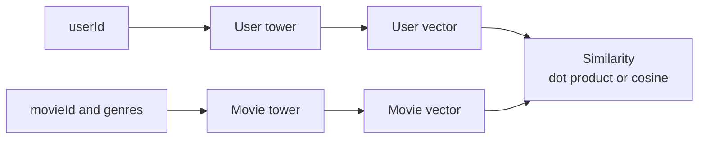

# Two tower retrieval

A two tower model learns one network for users and one network for items.

The reason it exists is simple: retrieval must be fast. If a service has millions of items, scoring every user-item pair with a heavy model is too slow. A two tower model computes a user embedding and an item embedding separately. Retrieval becomes nearest neighbor search in embedding space.

On MovieLens, the user tower can start with only `userId`. The movie tower can start with `movieId`, then add genres later. This repository uses PyTorch for the implementation so the same code path can use CUDA, MPS, or CPU.

The first version should train on positive interactions. For example, treat high ratings as watched and liked, then train the model to place the user's next movie near the user embedding.

The main thing to inspect is candidate quality. For a few users, compare their history with the top retrieved movies before adding a ranking model.

## Where retrieval sits

Recommendation is often split into stages:


A two tower model belongs to retrieval. It does not try to perfectly rank every movie. It tries to quickly find a useful candidate pool.

## What the two towers learn

The user tower answers: what vector represents this user?

The movie tower answers: what vector represents this movie?

Both vectors live in the same space. Training pulls users closer to movies they liked and farther from sampled unrelated movies.



The first version can use only `userId` and `movieId`. Add genres after the baseline works.

## One training example

Suppose user 42 has this high-rated history:

| Time | Movie | Rating |
| --- | --- | --- |
| 2020-01-01 | The Matrix | 5.0 |
| 2020-01-03 | Inception | 4.5 |
| 2020-01-10 | Interstellar | 5.0 |

A simple training example can be:

```text
input user feature: userId = 42
target movie: Interstellar
```

The model learns to place user 42's vector near Interstellar and farther from sampled movies.

| User | Positive movie | Negative movie |
| --- | --- | --- |
| 42 | Interstellar | Random comedy |
| 42 | Interstellar | Random horror |
| 42 | Interstellar | Random old drama |

The negatives are not true dislikes. They are unrated movies used as a training approximation.

## Reading retrieval results

If the user's history is:

```text
The Matrix, Inception, Interstellar
```

Reasonable retrieval results might include Blade Runner, Arrival, or The Dark Knight. If the top results are unrelated romance movies, inspect ID mappings, sampling, and whether the model only learned popularity.

## Run

From the repository root:

```bash
./02-retrieval/two-tower-tfrs/run.sh --sample-ratings none --save-checkpoints --checkpoint-every 0
```

This saves only `checkpoints/best.pt`; the generated report records the `.pt` file size.

For a faster trial run:

```bash
./02-retrieval/two-tower-tfrs/run.sh --sample-ratings 2000000 --save-checkpoints --checkpoint-every 0
```

To keep a few intermediate checkpoints too:

```bash
./02-retrieval/two-tower-tfrs/run.sh --sample-ratings none --save-checkpoints --checkpoint-every 20 --keep-checkpoints 3
```

The default DataLoader worker count is 8. Lower it with `--num-workers` if needed.

## Common mistakes

Do not treat retrieval as final ranking. Retrieval should avoid missing good candidates.

Do not overread negative samples. Unrated is not the same as disliked.

Check candidate quality manually. Metrics alone can hide popularity-heavy results.
