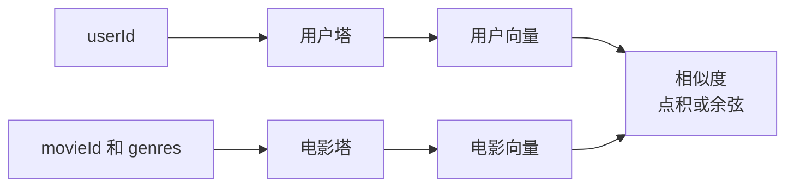
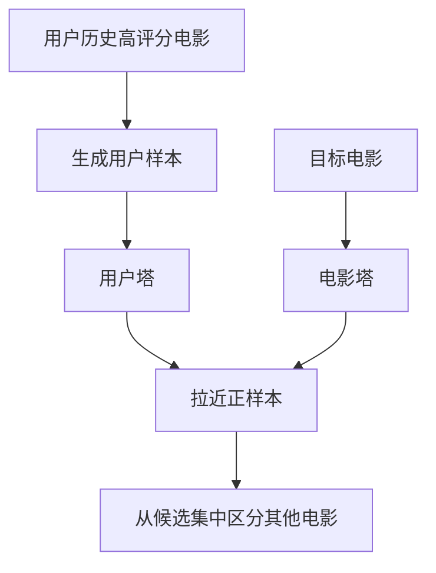

# 双塔召回

双塔模型分别学习一个用户塔和一个电影塔。

它存在的原因很简单：召回必须快。如果一个系统有几百万个物品，用复杂模型把所有用户和物品组合都算一遍会太慢。双塔模型把用户和电影分别算成 embedding，召回时就变成向量空间里的近邻搜索。

把它放在推荐系统流程里看，会更容易理解。真实系统通常不是一个模型从头算到尾，而是分阶段：


双塔模型主要做召回。它不追求把每部电影的分数算得特别精细，它追求快速找到“可能相关”的候选。

在 MovieLens 上，用户塔第一版可以只用 `userId`。电影塔第一版可以只用 `movieId`，后面再加 genres。本仓库统一用 PyTorch 实现，这样同一套代码可以走 `cuda`、`mps` 或 `cpu`。

第一版可以只用正样本训练。比如把高评分当作用户喜欢过的电影，让模型学会把用户 embedding 和他下一部可能喜欢的电影拉近。

## 两座塔分别学什么

用户塔负责回答：这个用户现在可以表示成什么向量？

电影塔负责回答：这部电影可以表示成什么向量？

两边的向量维度一样，最后放到同一个空间里。训练目标是让用户向量靠近他喜欢的电影，远离不相关电影。



第一版用户塔可以简单到只有一层 embedding lookup。电影塔也可以先只用 movieId embedding。等这个版本跑通，再把 genres 加进去。

## 为什么双塔适合大规模召回

重点在于电影向量可以提前算好。

如果有 100 万部电影，电影塔可以离线把这 100 万个电影向量都算出来，放进向量索引。线上来了一个用户请求，只需要算一次用户向量，然后去索引里找最近的电影。

这和 NCF 这类模型不一样。NCF 要把用户和电影拼在一起过 MLP，用户换了、电影换了都要重新算一遍。它更适合精排，不适合从百万级候选里直接找。

## MovieLens 上怎么构造训练样本

MovieLens 是评分数据，不是点击日志。第一版可以做一个简化：

- 评分大于等于 4.0：当成正样本。
- 用户没评分的电影：采样一部分当负样本或作为候选集合里的非目标项。
- 按时间切分：用过去的喜欢记录预测后面的喜欢记录。

这个实验使用 batch 内负样本。模型看到一批真实的用户-电影正样本，同一个 batch 里的其他电影会自然变成近似负样本。这样不用手写大量负采样逻辑，也能训练出召回向量。



## 一条训练样本长什么样

假设用户 42 的历史是：

| 时间 | 电影 | 评分 |
| --- | --- | --- |
| 2020-01-01 | The Matrix | 5.0 |
| 2020-01-03 | Inception | 4.5 |
| 2020-01-10 | Interstellar | 5.0 |

你可以把前两部当作用户历史，把第三部当作目标电影：

```text
输入用户特征：userId = 42
目标电影：Interstellar
```

最简双塔甚至不看历史，只用 `userId` 学一个用户 embedding。更进一步，可以把用户最近喜欢过的电影也放进用户塔，让用户向量更接近当前兴趣。

训练时，模型要做的是：让用户 42 的向量更接近 Interstellar 的向量，同时不要那么接近随机采样出来的其他电影。

| 用户 | 正样本电影 | 负样本电影 |
| --- | --- | --- |
| 42 | Interstellar | Random comedy movie |
| 42 | Interstellar | Random horror movie |
| 42 | Interstellar | Random old drama |

注意，负样本只是“这个用户没有评分过”，不一定真不喜欢。所以第一版不用把负样本解释得太死，它只是训练时用来拉开距离的近似。

## 召回结果怎么看

训练完后，拿一个用户做查询。假设用户历史是：

```text
The Matrix, Inception, Interstellar
```

双塔召回结果可能是：

| 排名 | 电影 | 你应该怎么判断 |
| --- | --- | --- |
| 1 | Blade Runner | 科幻味道接近，合理 |
| 2 | The Dark Knight | 动作和高热度，可能合理 |
| 3 | Random Romance | 如果历史里没有类似兴趣，要检查 |

不要只看 top 1。召回的目标是把可能喜欢的电影放进候选池，后面还会有精排。只要 top 100 里有足够多合理候选，双塔就有价值。

最该检查的是候选质量。先拿几个用户，把历史电影和召回出来的电影放在一起看，再决定要不要接精排模型。

## 第一版代码先做到什么程度

不要一开始就做复杂特征。先让流程闭环：

1. 读 MovieLens 评分。
2. 把高评分转成正反馈。
3. 为用户和电影建 vocabulary。
4. 写用户塔和电影塔。
5. 训练 retrieval task。
6. 建电影向量索引。
7. 输入一个用户，取回 top K 电影。

拿到结果后，不要只看 Recall@K。找几个用户，把他们喜欢过的电影、真实后续喜欢的电影、召回候选放在一起看。你会更快发现模型是在学类型相似、热门偏置，还是纯粹没学到东西。

## 常见坑

第一，负样本太随便。MovieLens 里用户没评分的电影不一定是不喜欢，所以负采样只能当近似。

第二，把召回当精排。双塔召回的目标是“不漏掉可能喜欢的电影”，不是给最终顺序一锤定音。

第三，离线指标看起来不错，但召回结果全是热门电影。热门电影确实容易被很多用户喜欢，但如果列表没有个性化，就要检查采样方式和训练目标。

## 运行方式

从仓库根目录运行：

```bash
./02-retrieval/two-tower-tfrs/run.sh --sample-ratings none --save-checkpoints --checkpoint-every 0
```

这个命令只保存 `checkpoints/best.pt`，生成后的报告会记录 `.pt` 文件大小。

想先快速试跑：

```bash
./02-retrieval/two-tower-tfrs/run.sh --sample-ratings 2000000 --save-checkpoints --checkpoint-every 0
```

想额外保留几个中间 checkpoint：

```bash
./02-retrieval/two-tower-tfrs/run.sh --sample-ratings none --save-checkpoints --checkpoint-every 20 --keep-checkpoints 3
```

完全不想写 `.pt` 时，可以加 `--no-save-checkpoints`。

默认 DataLoader worker 数是 8。如果机器负载太高，可以用 `--num-workers` 调小。
