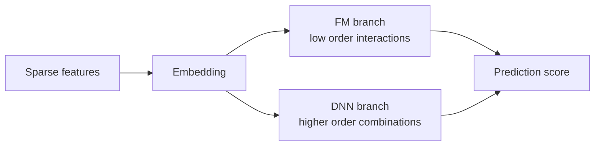

# DeepFM

DeepFM combines FM style low order interactions with a neural network.

The FM part is good at pairwise feature crossings. The deep part takes the same feature embeddings and learns nonlinear combinations. This is useful when the signal is not just "user plus genre" but several fields working together.

On MovieLens, DeepFM can use user ID, movie ID, genres, and time buckets. The target can be rating prediction or a binary label such as rating greater than or equal to 4.0.

The first version should keep the feature set small. Add features one at a time and compare against FM. If the deep part improves metrics but recommendations look worse, inspect examples before trusting the number.



The point of DeepFM is not that neural networks automatically solve recommendation. The useful part is the split of responsibility. The FM branch keeps a direct path for stable pairwise interactions, while the DNN branch can combine several fields in a less rigid way.

In this repository, DeepFM uses the same feature pipeline as FM: user ID, movie ID, genres, and timestamp hour bucket. The label is binary: `rating >= 4.0`.

## Run

Default full-dataset run:

```bash
./03-feature-crossing/deepfm/run.sh --sample-ratings none --num-workers 8 --save-checkpoints --checkpoint-every 0
```

For a faster trial run:

```bash
./03-feature-crossing/deepfm/run.sh --sample-ratings 2000000 --num-workers 8 --save-checkpoints --checkpoint-every 0
```

The default command saves only `checkpoints/best.pt`. The report records validation metrics, held-out prediction examples, and checkpoint size.
