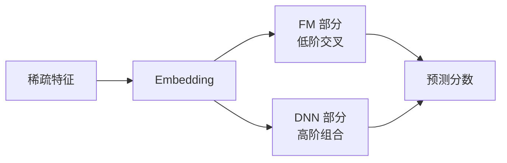

# DeepFM

DeepFM 把 FM 的低阶交叉和神经网络放在一起。

FM 部分擅长学习二阶特征交叉。Deep 部分拿同一批特征 embedding，继续学习更复杂的非线性组合。它适合处理那种不是单个特征能解释的信号，比如用户、电影类型、时间段一起影响结果。

在 MovieLens 上，DeepFM 可以使用用户 ID、电影 ID、genres 和时间段。目标可以是预测评分，也可以把评分大于等于 4.0 当成正样本做二分类。

第一版不要把特征堆太多。先用少量特征跑通，再一个一个加，并和 FM 对比。如果指标变好但推荐结果看起来奇怪，要先看样例，不要只信数字。

DeepFM 的好处是不用手工指定哪些特征交叉。FM 分支负责比较稳定的二阶关系，DNN 分支负责更复杂的组合。

第一版可以做二分类：评分大于等于 4.0 当作喜欢，否则不作为正样本。跑完后和 FM 对比，看看深度分支是否真的带来提升。

常见坑是把特征一次性加太多。模型变复杂以后，指标涨了也不一定说明模型更懂用户，可能只是记住了训练集。
