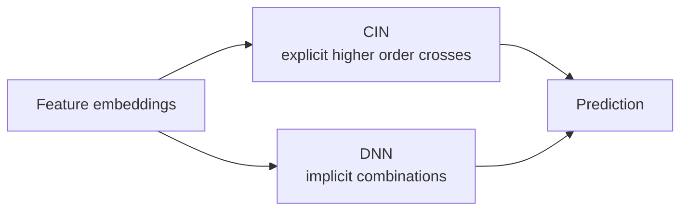

# xDeepFM

xDeepFM tries to model feature crossing more explicitly than a plain deep network.

DeepFM relies on an MLP to learn high order interactions. xDeepFM adds a compressed interaction network, often called CIN, to build bounded degree feature interactions in a more structured way.

On MovieLens, xDeepFM is a later experiment after FM and DeepFM are working. It uses the same basic fields, so the interesting question is whether the interaction module adds value beyond a normal MLP.

The first implementation should reuse the DeepFM data pipeline. Keep the model comparison fair: same split, same labels, same metrics, and similar embedding sizes.



xDeepFM is not just "make the network deeper." The CIN part tries to keep the crossing structure visible. A plain MLP may learn useful high order interactions, but it hides them inside dense layers. CIN builds interactions layer by layer, then compresses them so the model does not explode in size.

On MovieLens, do not expect xDeepFM to always win. The available fields are simple, so FM or DeepFM may already be strong enough. The main value of this experiment is seeing what explicit high order crossing looks like in code.

## Run

Default full-dataset run:

```bash
./03-feature-crossing/xdeepfm/run.sh --sample-ratings none --num-workers 8 --save-checkpoints --checkpoint-every 0
```

For a faster trial run:

```bash
./03-feature-crossing/xdeepfm/run.sh --sample-ratings 2000000 --num-workers 8 --save-checkpoints --checkpoint-every 0
```

The default command saves only `checkpoints/best.pt`. The report records validation metrics, held-out prediction examples, and checkpoint size.
