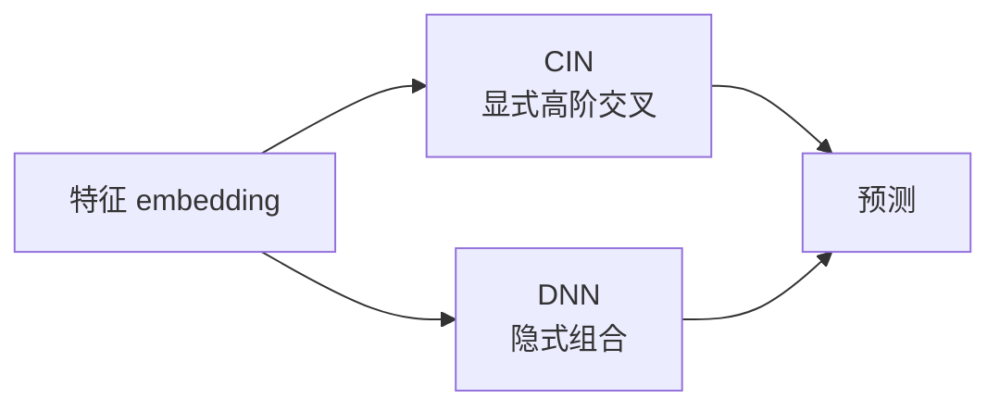

# xDeepFM

xDeepFM 想比普通深度网络更明确地建模特征交叉。

DeepFM 主要依赖 MLP 学高阶交互。xDeepFM 加了 CIN，也就是压缩交互网络，用更结构化的方式构造有限阶的特征组合。

在 MovieLens 上，xDeepFM 适合放在 FM 和 DeepFM 之后再写。它用的字段基本一样，所以真正要观察的是：这个交互模块是不是比普通 MLP 多带来了价值。

第一版应该复用 DeepFM 的数据管线。对比要公平：同一套切分、同一套标签、同一套指标，embedding 大小也尽量接近。



xDeepFM 的重点不是“更深”，而是更有结构地建模交叉。普通 MLP 可能学到高阶关系，但不一定容易解释。CIN 会把不同阶的特征组合显式组织起来。

在 MovieLens 上，先不要期待它一定赢。数据字段比较简单时，FM 或 DeepFM 可能已经够用。xDeepFM 更适合用来学习“显式高阶交叉”这个思路。

## 运行

默认全量运行：

```bash
./03-feature-crossing/xdeepfm/run.sh --sample-ratings none --num-workers 8 --save-checkpoints --checkpoint-every 0
```

想先快速试跑：

```bash
./03-feature-crossing/xdeepfm/run.sh --sample-ratings 2000000 --num-workers 8 --save-checkpoints --checkpoint-every 0
```

默认命令只保存 `checkpoints/best.pt`。报告会写入验证指标、测试集预测样例和 checkpoint 大小。
