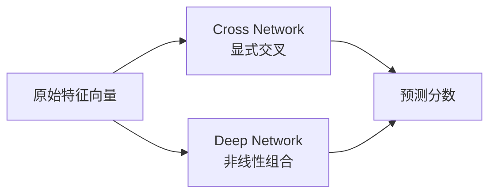

# DCN

DCN，也就是 Deep and Cross Network，用 cross network 显式学习特征交叉。

很多排序问题的关键信号来自特征组合。DCN 的 cross layer 会不断把原始特征向量和当前表示混合起来。相比手写交叉，它能搜索更大的组合空间；相比普通 MLP，它的交叉结构更明确。

在 MovieLens 上，DCN 可以使用和 DeepFM 类似的字段：用户 ID、电影 ID、genres 和时间段。它是精排模型，所以最好放在召回之后评估，或者在采样后的候选集上评估。

第一版建议拿 DCN 和普通 MLP 对比，并保持 embedding 设置一致。这样才能看出 cross network 到底有没有起作用。

DCN 的直觉是：有些组合非常重要，比如“某用户 + 某类型 + 某时间段”。手写所有组合太累，普通 MLP 又不够直接。Cross Network 让模型用更结构化的方式反复混合原始特征。

在 MovieLens 上，第一版可以使用用户 ID、电影 ID、genres 和时间段。不要一开始堆太多层。先跑普通 MLP，再加 cross layer，对比同一套指标和推荐样例。
