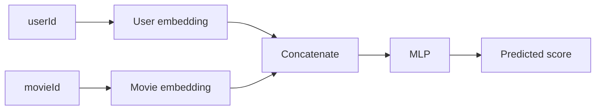
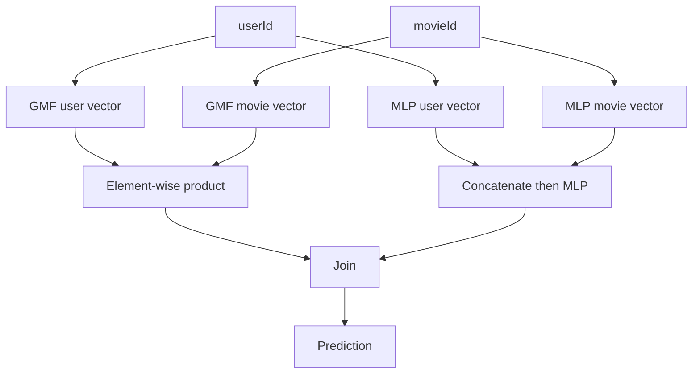

# NCF

Neural Collaborative Filtering replaces the dot product with a neural network.

Matrix factorization uses `user_embedding dot item_embedding`. That is simple and fast, but it assumes the interaction between user and item factors is mostly linear. NCF asks whether an MLP can learn a richer interaction function.

On MovieLens, NCF usually takes a user ID and a movie ID, looks up two embeddings, concatenates them, and sends the result through dense layers. The target can be a rating or a binary liked label.

The first version should compare three models:

1. matrix factorization
2. MLP only NCF
3. a combined GMF plus MLP version

NCF is a good way to see that "deep" does not automatically mean better. If the split is small or negative sampling is weak, a simple matrix factorization baseline can be hard to beat.

## How it differs from matrix factorization

Matrix factorization uses:

```text
score = user_embedding dot movie_embedding
```

The dot product asks whether the two vectors point in similar directions.

NCF gives the user vector and movie vector to a neural network and lets the network learn the interaction function.



That flexibility can help, but it is not free. With weak negative sampling or too little data, NCF can simply memorize.

## One training example

If user 42 rated The Matrix as 5.0, a binary version can create:

```text
userId = 42
movieId = The Matrix
label = 1
```

Then sample an unrated movie:

```text
userId = 42
movieId = Random Movie
label = 0
```

The model outputs a value near 1 for likely liked movies and near 0 for sampled negatives.

## GMF plus MLP

The common NCF version combines a matrix-factorization-like path and an MLP path:



The GMF side keeps simple collaborative signal. The MLP side learns more flexible interactions.

## How to inspect results

Print users with high-rated history and top recommendations:

| User history | NCF recommendations |
| --- | --- |
| The Matrix, Inception, Interstellar | Blade Runner, Arrival, The Dark Knight |

If recommendations are only popular movies, check negative sampling. If they are unrelated, check ID mapping and train/test splitting.

## Run

Runnable PyTorch NCF code will follow:

```bash
./04-deep-ranking/ncf/run.sh --sample-ratings 2000000
```

## Common mistakes

Do not treat every unrated movie as a true negative.

Do not start with a very deep MLP. Two or three layers are enough for a first pass.

Always compare against matrix factorization.
