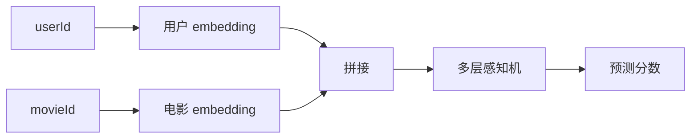
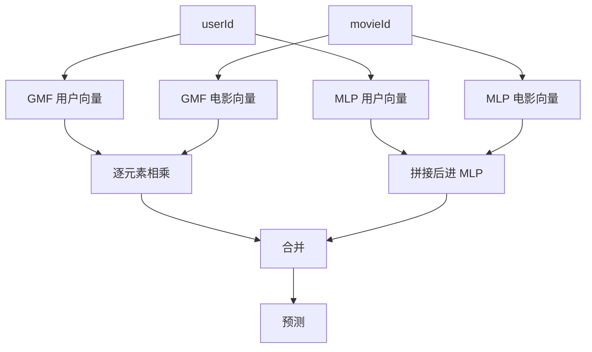

# NCF

NCF 用神经网络替代传统矩阵分解里的点积。

矩阵分解通常是 `user_embedding dot item_embedding`。这个做法简单、快，但它默认用户和电影因子的交互方式比较线性。NCF 想问的是：能不能让 MLP 自己学一个更复杂的交互函数？



在 MovieLens 上，NCF 通常输入用户 ID 和电影 ID，查出两个 embedding，拼接后送进全连接网络。目标可以是评分预测，也可以把高评分当成喜欢做二分类。

第一版建议对比三个模型：

1. 矩阵分解
2. 只有 MLP 的 NCF
3. GMF 加 MLP 的组合版本

NCF 很适合用来理解一件事：深度模型不一定天然更强。如果数据切分小，或者负采样做得不好，简单的矩阵分解可能很难被超过。

## 它和矩阵分解到底差在哪

矩阵分解的核心交互是点积：

```text
score = user_embedding dot movie_embedding
```

点积很像在问：用户向量和电影向量方向接近吗？接近就分高。

NCF 换了一个问题：把用户向量和电影向量交给一个神经网络，让网络自己判断它们怎么组合才合理。

这让模型更灵活，但也更难训练。灵活不是免费午餐。数据不够、负样本不好、模型太大时，NCF 可能只是更会记训练集。

## 一条训练样本长什么样

假设用户 42 给 The Matrix 打了 5 分。做二分类时，可以把它变成正样本：

```text
userId = 42
movieId = The Matrix
label = 1
```

再采样一部用户 42 没评分过的电影当负样本：

```text
userId = 42
movieId = Random Movie
label = 0
```

模型会分别查 embedding：

| 输入 | 查到的向量 |
| --- | --- |
| userId 42 | 用户 embedding |
| The Matrix | 电影 embedding |

然后把两个向量拼起来，送进 MLP，输出一个 0 到 1 之间的分数。分数越高，表示模型越认为用户会喜欢这部电影。

## GMF 加 MLP 是什么

NCF 论文里常见一个组合结构：一边保留类似矩阵分解的 GMF，一边使用 MLP，最后把两边结果合起来。



这样做的意思是：既保留点积类模型的简单协同信号，也让 MLP 学复杂交互。

## 怎么判断 NCF 有没有学到东西

不要只看 loss。拿几个用户打印推荐列表：

| 用户历史高评分 | NCF 推荐 |
| --- | --- |
| The Matrix, Inception, Interstellar | Blade Runner, Arrival, The Dark Knight |

如果推荐全是热门电影，可能模型学到了流行度，但个性化不够。

如果推荐和用户历史完全没关系，先检查负采样、ID 映射、训练集和测试集切分。

## 常见坑

不要把所有没评分电影都当负样本。那样负样本数量太大，而且语义也不准。

不要一开始堆很深的 MLP。两三层足够做第一版。

不要忘记和矩阵分解对比。NCF 的意义不是名字更高级，而是它在同一套数据切分和指标下真的带来提升。
