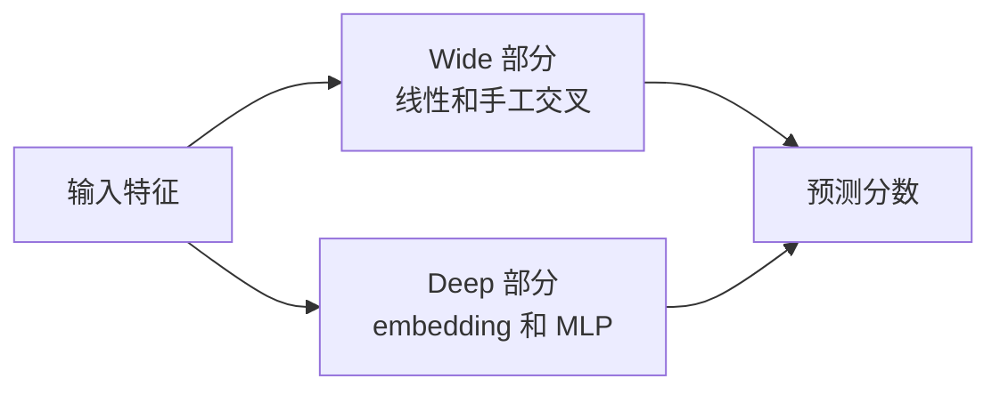

# Wide and deep

Wide and deep 把记忆能力和泛化能力放在一个模型里。

Wide 部分是线性模型，使用原始特征或手动交叉特征。它适合记住训练数据里经常出现的模式。Deep 部分使用 embedding 和全连接层，适合泛化到没有完全见过的组合。

在 MovieLens 上，Wide 侧可以用用户 ID、电影 ID 和少量简单交叉特征。Deep 侧可以用 ID 和 genres 的 embedding。最后输出一个用户-电影组合的分数。

第一版要让 wide 侧的交叉特征能解释。如果说不清某个交叉为什么存在，就先别加。这个模型最有价值的地方，是 wide 侧记住明确规则，deep 侧处理更软的相似性。



Wide 部分像记规则。比如某些用户和某些电影组合在历史里表现很好，wide 侧可以直接记住。Deep 部分像学泛化。比如没见过完全一样的组合，也能通过 embedding 找到相似模式。

在 MovieLens 上，第一版 wide 侧可以只放少量交叉，比如用户和 genre。Deep 侧放用户、电影和 genre embedding。跑完要和只用 deep 的模型对比，看看 wide 侧是不是真的有帮助。

## 运行

默认全量运行：

```bash
./04-deep-ranking/wide-and-deep/run.sh --sample-ratings none --num-workers 8 --save-checkpoints --checkpoint-every 0
```

【非主线】想先快速试跑：

```bash
./04-deep-ranking/wide-and-deep/run.sh --sample-ratings 2000000 --num-workers 8 --save-checkpoints --checkpoint-every 0
```

默认命令只保存 `checkpoints/best.pt`。报告会写入验证指标、测试集预测样例和 checkpoint 大小。
