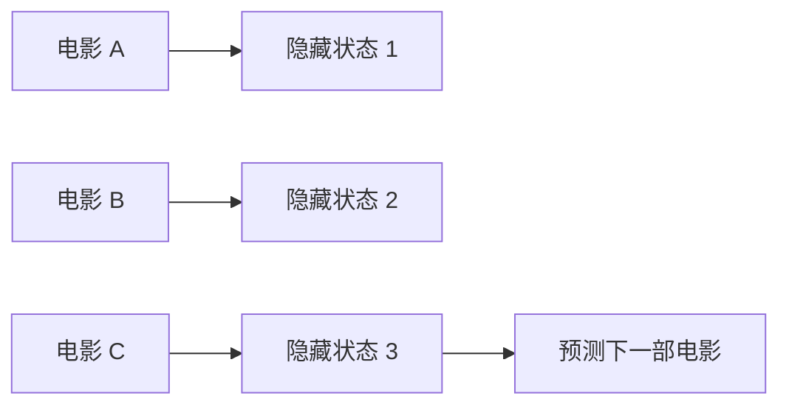

# GRU4Rec

GRU4Rec 把用户历史看成一个序列。

早期协同过滤通常不管顺序。GRU4Rec 把问题从“这个用户总体喜欢什么”改成“看完最近这些电影后，下一部可能是什么”。它用循环神经网络，通常是 GRU，在每看完一个物品后更新隐藏状态。

在 MovieLens 上，先按 timestamp 排列每个用户的评分记录。输入是一段已经看过或喜欢过的电影，目标是下一部电影。因为全量预测所有电影很贵，可以用负采样训练。

第一版可以限制序列长度，必要时也可以先用较小的电影集合。调试时打印：历史电影、真实下一部电影、模型推荐的前几部电影。序列模型一定要看顺序，否则很难判断错在哪里。

GRU4Rec 的隐藏状态可以理解成“用户当前兴趣的压缩表示”。每输入一部电影，隐藏状态都会更新。模型最后用这个状态预测下一部电影。

在 MovieLens 上，一条训练样本可以是：

| 输入序列 | 目标 |
| --- | --- |
| The Matrix, Inception | Interstellar |

常见坑是把用户历史打乱。GRU4Rec 依赖顺序，一旦打乱，它就退化成很别扭的普通协同过滤。
