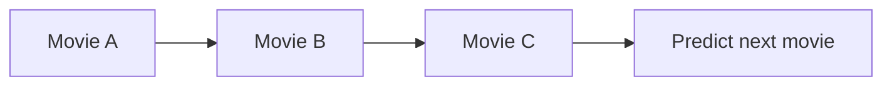
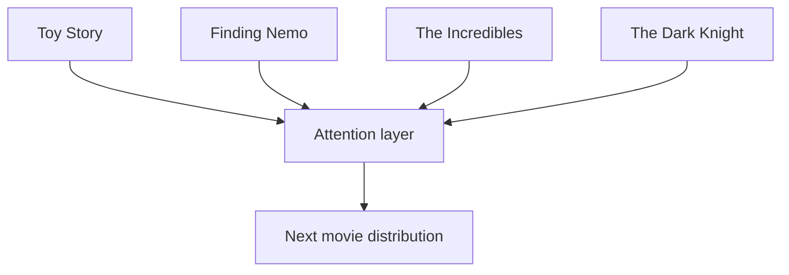
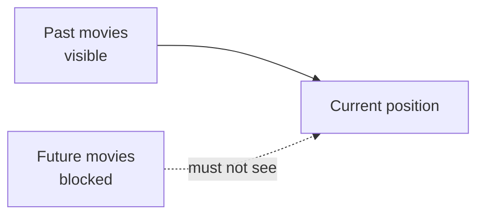

# SASRec

SASRec uses self attention for sequential recommendation.

GRU4Rec reads the sequence step by step. SASRec lets each position attend to earlier positions, which makes it better at picking the most relevant parts of the user's history. A recent movie may matter most, but sometimes a much older movie explains the next choice better.

On MovieLens, build sequences sorted by timestamp. The model sees previous movie IDs and predicts the next movie ID. A causal mask prevents the model from looking at future items during training.

The first version should focus on correct masking and data splitting. If the model can accidentally see future movies, the metric will look good for the wrong reason.

SASRec is a strong baseline because it keeps the recommendation problem close to next token prediction, but with movie IDs instead of words.

## Why order matters

The same set of movies can imply different next choices depending on order. A user who watched three sci-fi movies this week may have a current sci-fi intent. A user who watched those movies years apart may not.



## What self attention does

When predicting the next movie, SASRec looks back at earlier positions and learns which ones matter most.

Example history:

```text
Toy Story -> Finding Nemo -> The Incredibles -> The Dark Knight
```

The recent movie may matter most, but older animation movies may still reveal long-term taste.



## One training sequence

For a user sequence:

```text
[Toy Story, Finding Nemo, The Incredibles, WALL-E, Up]
```

Training examples:

| Input sequence | Target |
| --- | --- |
| Toy Story | Finding Nemo |
| Toy Story, Finding Nemo | The Incredibles |
| Toy Story, Finding Nemo, The Incredibles | WALL-E |
| Toy Story, Finding Nemo, The Incredibles, WALL-E | Up |

If max length is 3, the last example becomes:

```text
input: Finding Nemo, The Incredibles, WALL-E
target: Up
```

## Why causal mask matters

When predicting `C` from `A, B, C, D`, the model must not see `D`. A causal mask blocks future positions.



If the mask is wrong, metrics can look great for the wrong reason.

## Run

Default full-dataset run:

```bash
./05-sequential-recommendation/sasrec/run.sh --sample-ratings none --num-workers 8 --save-checkpoints --checkpoint-every 0
```

Non-main path: for a faster trial run:

```bash
./05-sequential-recommendation/sasrec/run.sh --sample-ratings 2000000 --num-workers 8 --save-checkpoints --checkpoint-every 0
```

The default command saves only `checkpoints/best.pt`. The report records validation metrics, test metrics, sequence examples, and checkpoint size.

## Common mistakes

Do not shuffle a user's history.

Do not let future movies enter the training prefix.

Start with a modest max sequence length such as 50 or 100.
