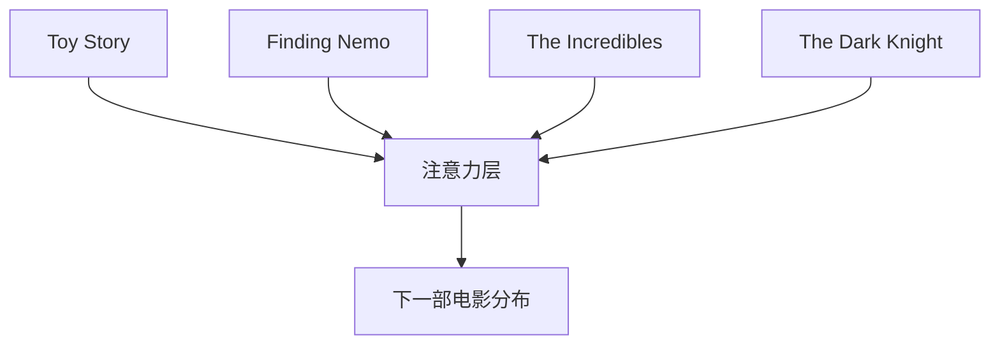
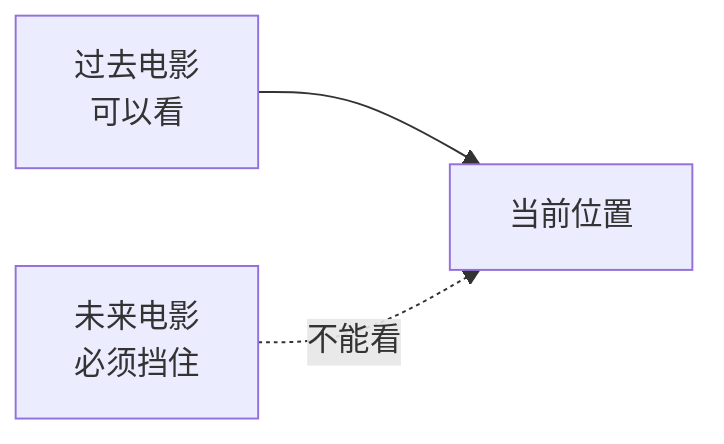

# SASRec

SASRec 用自注意力做序列推荐。

GRU4Rec 是一步一步读序列。SASRec 让当前位置可以关注前面不同位置的电影，所以更容易抓住用户历史里真正相关的部分。最近看的电影经常重要，但有时更早的一部电影反而更能解释下一次选择。

序列推荐关心的是“顺序”。同一个用户看过同样几部电影，如果顺序不同，下一步可能也不同。一个人最近连续看悬疑片，说明他现在可能就在这个兴趣里；另一个人几年前看过悬疑片，最近都在看动画片，那下一部电影就不一定还和悬疑有关。


在 MovieLens 上，先按 timestamp 构造用户序列。模型看到前面的电影 ID，预测下一部电影 ID。训练时必须用 causal mask，避免模型偷看到未来电影。

第一版最该关注的是 mask 和数据切分。如果模型不小心看到了未来，指标会很好看，但那是假的。

SASRec 是很强的 baseline，因为它把推荐问题变得很像 next token prediction，只是 token 从词变成了电影 ID。

## 自注意力到底在做什么

你可以把 SASRec 想成：模型在预测下一部电影时，会回头看用户历史里的每个位置，然后决定哪些位置更重要。

假设用户历史是：

```text
Toy Story -> Finding Nemo -> The Incredibles -> The Dark Knight
```

如果要预测下一部电影，模型可能会发现最近的 `The Dark Knight` 很重要，因为它代表当前兴趣；也可能发现更早的动画片也有影响，因为这个用户长期喜欢动画。自注意力的作用，就是给不同历史位置分配不同权重。



## 为什么必须有 causal mask

训练序列模型时，最容易犯的错是让模型偷看答案。

比如序列是：

```text
A, B, C, D
```

训练时，模型应该用 `A` 预测 `B`，用 `A, B` 预测 `C`，用 `A, B, C` 预测 `D`。它不能在预测 `C` 的时候看到 `D`。

causal mask 就是把未来位置挡住。



如果 mask 写错，模型会在训练或评估时提前看到未来电影，指标会变得很好看，但没有意义。

## MovieLens 上怎么做序列

第一版可以这样处理：

1. 只保留高评分电影，比如 `rating >= 4.0`。
2. 按用户分组。
3. 每个用户内部按 `timestamp` 排序。
4. 把电影 ID 序列截断到固定长度，比如 50。
5. 用前面的电影预测后面的电影。

短序列用户可以先过滤掉。不是因为他们不重要，而是第一版模型需要足够历史才能学到顺序信号。

## 一条训练样本怎么切出来

假设某个用户按时间排序后的高评分电影是：

```text
[Toy Story, Finding Nemo, The Incredibles, WALL-E, Up]
```

训练时可以拆成多条 next item 预测：

| 输入序列 | 目标 |
| --- | --- |
| Toy Story | Finding Nemo |
| Toy Story, Finding Nemo | The Incredibles |
| Toy Story, Finding Nemo, The Incredibles | WALL-E |
| Toy Story, Finding Nemo, The Incredibles, WALL-E | Up |

如果设最大长度为 3，最后一条会被截成：

```text
输入：Finding Nemo, The Incredibles, WALL-E
目标：Up
```

这不是随便丢信息，而是让模型专注最近一段历史。第一版这么做更容易训练，也更容易调试。

## 注意力权重怎么看

假设模型在预测 `Up` 时，对历史电影的注意力大概是：

| 历史电影 | 注意力权重 |
| --- | --- |
| Finding Nemo | 0.20 |
| The Incredibles | 0.35 |
| WALL-E | 0.45 |

这说明模型更看重最近的 WALL-E，也没有完全丢掉前面的动画片信号。

真实模型不一定会给你这么清楚的解释，但这个表能帮助你理解 SASRec 的优势：它不是把历史平均一下，而是在不同位置之间分配权重。

## 第一版要打印什么

除了 Recall@K 或 NDCG@K，建议打印这种样例：

| 用户历史 | 真实下一部 | 模型 top 5 |
| --- | --- | --- |
| Toy Story, Finding Nemo, The Incredibles | Monsters Inc. | Monsters Inc., Shrek, Cars, ... |

如果模型 top 5 全是热门电影，说明它可能没学到顺序，只学到了流行度。如果 top 5 和历史类型完全不搭，也要检查电影 ID 映射、mask 和时间排序。

## 常见坑

不要随机打乱同一个用户的历史。序列模型最值钱的信息就是顺序。

不要把测试集里的未来电影放进训练序列。时间切分要在用户序列内部做清楚。

不要一开始把序列长度设得特别长。长序列更费显存，也更难调试。先用 50 或 100 这种长度跑通。

## 运行

默认全量运行：

```bash
./05-sequential-recommendation/sasrec/run.sh --sample-ratings none --num-workers 8 --save-checkpoints --checkpoint-every 0
```

【非主线】想先快速试跑：

```bash
./05-sequential-recommendation/sasrec/run.sh --sample-ratings 2000000 --num-workers 8 --save-checkpoints --checkpoint-every 0
```

默认命令只保存 `checkpoints/best.pt`。报告会写入验证指标、测试指标、序列样例和 checkpoint 大小。
