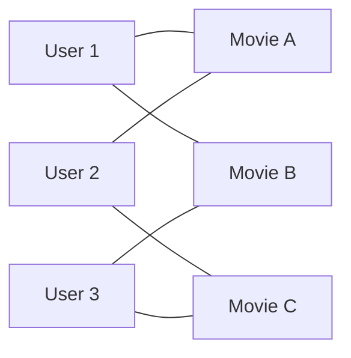
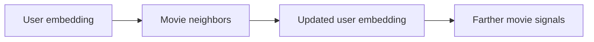

# LightGCN

LightGCN simplifies graph neural recommendation.

NGCF introduced graph convolution for user-item graphs, but some neural network parts were not always helpful. LightGCN removes feature transformation and nonlinear activation, then keeps the part that matters most: passing embeddings along user-item edges and averaging layer outputs.

On MovieLens, create a bipartite graph. Users are one node type, movies are another node type, and ratings become edges. Many implementations keep only positive interactions, such as ratings greater than or equal to 4.0.

The first implementation should:

1. Build the user-movie graph.
2. Initialize user and movie embeddings.
3. Propagate embeddings for a few layers.
4. Train with Bayesian Personalized Ranking loss or sampled softmax.

LightGCN is popular because it is simple and strong. That makes it a good graph baseline.

## The graph view

MovieLens naturally forms a bipartite graph. Users are one node type, movies are another, and positive interactions become edges.



If User 1 and User 2 both connect to Movie A, they may share taste. If Movie B and Movie C are connected through similar users, that structure is useful too.

## Message passing

Message passing means a node updates its representation from its neighbors.

Users receive information from movies they liked. Movies receive information from users who liked them. After two layers, a user can indirectly receive signals from other users and other movies.



LightGCN is intentionally simple. It removes heavy neural transformations and keeps the collaborative graph signal.

## Why average layers

Layer 0 is the initial embedding. Layer 1 includes direct neighbors. Layer 2 includes farther neighbors.

Using only the last layer can over-smooth embeddings. LightGCN averages layers:

```text
final embedding = average(layer 0, layer 1, layer 2, ...)
```

## BPR example

For user U1:

```text
positive movie: A
negative sampled movie: C
goal: score(U1, A) > score(U1, C)
```

If the model scores the negative higher, BPR loss pushes U1 closer to A and farther from C.

The negative is not guaranteed to be a true dislike. It is an unrated sampled item.

## Run

Default full-dataset run:

```bash
./06-graph-recommendation/lightgcn/run.sh --sample-ratings none --num-workers 8 --save-checkpoints --checkpoint-every 0
```

Non-main path: for a faster trial run:

```bash
./06-graph-recommendation/lightgcn/run.sh --sample-ratings 2000000 --num-workers 8 --save-checkpoints --checkpoint-every 0
```

The default command saves only `checkpoints/best.pt`. The report records validation metrics, test metrics, recommendation examples, and checkpoint size.

## Common mistakes

Do not start with the full graph if you are debugging the implementation.

Do not use too many propagation layers. Two or three layers are enough for a first pass.

Remember that sampled negatives are approximations, not true dislikes.
