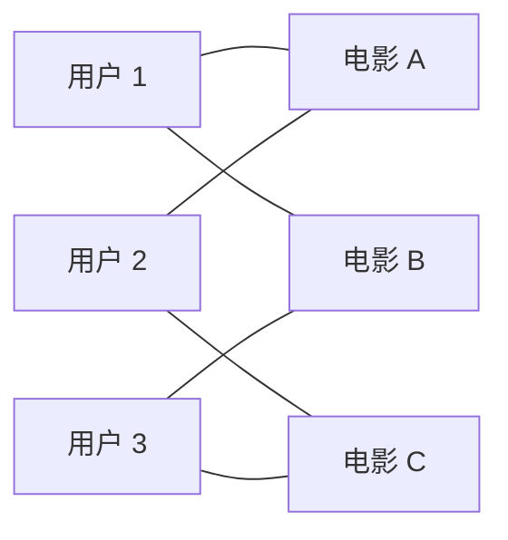
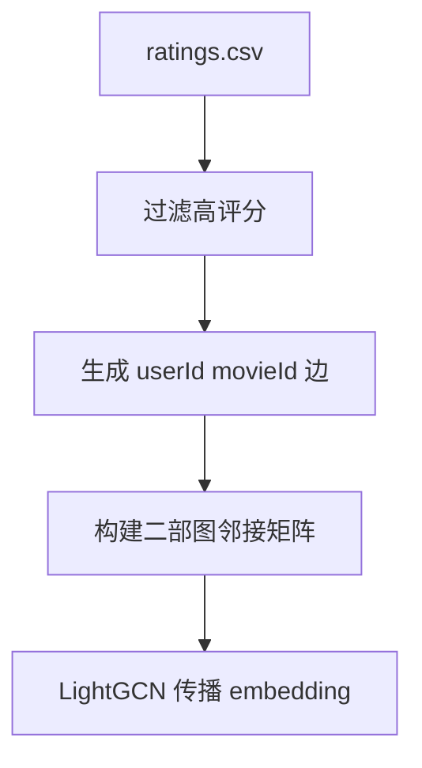

# LightGCN

LightGCN 是图推荐里一个更简洁的版本。

NGCF 把图卷积引入用户-物品图，但里面一些神经网络组件不一定总有帮助。LightGCN 去掉特征变换和非线性激活，只保留最核心的部分：沿着用户-电影边传播 embedding，并把不同层的结果做平均。

把 MovieLens 看成图以后，事情会变得很直观。用户是点，电影也是点。用户给电影打过高分，就在这两个点之间连一条边。



这张图里，用户 1 和用户 2 都连到了电影 A，所以他们可能有一点相似。电影 B 和电影 C 虽然没有直接连接，但它们都通过用户 3 和其他用户发生关系。LightGCN 就是在利用这种连接结构。

在 MovieLens 上，可以构造一张二部图。用户是一类节点，电影是一类节点，评分记录是边。很多实现会只保留正反馈，比如评分大于等于 4.0。

第一版代码建议这样写：

1. 构建用户-电影图。
2. 初始化用户和电影 embedding。
3. 做几层 embedding 传播。
4. 用 BPR loss 或 sampled softmax 训练。

LightGCN 流行的原因是简单而且强，所以很适合作为图推荐 baseline。

## 消息传递是什么意思

消息传递听起来抽象，其实可以这样理解：一个节点的表示，会从邻居那里吸收信息。

用户节点的邻居是他喜欢过的电影。电影节点的邻居是喜欢过它的用户。传播一层后，用户 embedding 混入了电影信息，电影 embedding 混入了用户信息。传播两层后，用户还能间接接触到“和我喜欢同一批电影的人还喜欢什么”。


LightGCN 的特点是克制。它不在传播过程中加复杂 MLP，也不加激活函数。它认为推荐图里最重要的是协同信号本身，也就是谁和谁连在一起。

## 为什么要平均多层结果

第 0 层 embedding 是每个用户和电影自己的初始表示。第 1 层混入直接邻居。第 2 层混入更远的邻居。不同层代表不同范围的信息。

如果只用最后一层，可能会把信息传播得太远，导致大家变得太像。LightGCN 通常把多层 embedding 平均起来：

```text
最终 embedding = 第 0 层 + 第 1 层 + 第 2 层 + ... 的平均
```

这样既保留自己的初始表示，也吸收邻居信息。

## MovieLens 上怎么建图

第一版可以只保留正反馈边：

- `rating >= 4.0`：连边
- `rating < 4.0`：先不连边
- 没评分：未知，不连边

然后把用户 ID 和电影 ID 分别重新编号。图是二部图，用户只连电影，电影只连用户。



## BPR loss 在干什么

BPR 的想法是：对同一个用户，他喜欢过的电影应该排在没交互过的电影前面。

训练样本通常长这样：

```text
用户 u，正样本电影 i，负样本电影 j
目标：score(u, i) > score(u, j)
```

它不要求模型预测具体评分，只要求排序方向对。这很适合推荐，因为很多时候我们关心的是 top K 列表，而不是准确预测用户会打 4.0 还是 4.5。

## 用小图看两层传播

假设有这样一张小图：

```text
用户 U1 喜欢电影 A、B
用户 U2 喜欢电影 A、C
用户 U3 喜欢电影 C、D
```

第一层传播后：

- U1 会吸收 A、B 的信息
- A 会吸收 U1、U2 的信息
- C 会吸收 U2、U3 的信息

第二层传播后，U1 会间接接触到 U2 的信息，因为他们都连着 A。U1 也会间接接触到 C，因为 U2 连着 C。

这就是图推荐里很有用的地方：模型不只看“我直接喜欢过什么”，还看“和我有共同兴趣的人还喜欢什么”。

用推荐语言说：

| 路径 | 含义 |
| --- | --- |
| U1 -> A | U1 喜欢 A |
| U1 -> A -> U2 | U1 和 U2 都喜欢 A |
| U1 -> A -> U2 -> C | 和 U1 相似的 U2 喜欢 C |

所以 C 可能成为 U1 的候选推荐。

## 一个 BPR 样本例子

假设 U1 喜欢 A 和 B，没有和 C 交互。训练时可以采样：

```text
用户：U1
正样本：A
负样本：C
```

模型当前打分：

```text
score(U1, A) = 1.2
score(U1, C) = 0.9
```

这个方向是对的，因为正样本比分数更高。但如果模型打成：

```text
score(U1, A) = 0.7
score(U1, C) = 1.1
```

BPR loss 就会惩罚它，推动 U1 更靠近 A，远离 C。

注意这里的 C 不一定真是 U1 讨厌的电影。它只是 U1 没交互过的采样电影。这个近似不完美，但在隐式反馈推荐里很常用。

## 常见坑

第一，图太大时不要先急着全量训练。可以先取一个用户和电影子集，确认传播、采样和 loss 都没问题。

第二，负样本不是严格负反馈。用户没看过某部电影，不代表不喜欢。BPR 里的负样本只是训练近似。

第三，层数不要太深。传播太多层会让 embedding 过度平滑，最后用户和电影都变得差不多。第一版用 2 到 3 层就够了。

## 运行

默认全量运行：

```bash
./06-graph-recommendation/lightgcn/run.sh --sample-ratings none --num-workers 8 --save-checkpoints --checkpoint-every 0
```

【非主线】想先快速试跑：

```bash
./06-graph-recommendation/lightgcn/run.sh --sample-ratings 2000000 --num-workers 8 --save-checkpoints --checkpoint-every 0
```

默认命令只保存 `checkpoints/best.pt`。报告会写入验证指标、测试指标、推荐样例和 checkpoint 大小。
