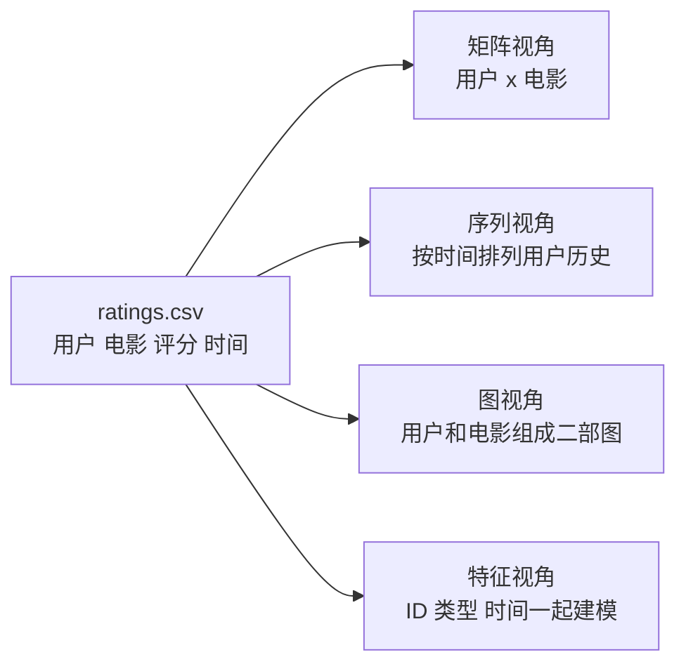

# MovieLens 数据集

MovieLens 是这个仓库的共同数据集。它不复杂，但字段刚好够用，适合用同一批数据把推荐系统里的主要思路跑一遍。

如果你刚开始学推荐系统，不要一上来就盯着模型名字。先把 MovieLens 看成一张很朴素的行为记录表：某个用户，在某个时间，给某部电影打了一个分。推荐系统后面的很多算法，其实就是在不同角度解释这张表。

有的方法把它看成矩阵，有的方法把它看成序列，有的方法把它看成图。数据没有变，变的是你看它的方式。

最常用的字段很直白：

- user ID：谁打了分
- movie ID：给哪部电影打分
- rating：显式评分，MovieLens 32M 里是 0.5 到 5.0
- timestamp：评分发生的时间
- genres：电影类型，比如喜剧、动作、科幻

这些字段放在一起就很有用。Item-CF 可以只看用户和电影 ID。矩阵分解可以从评分里学用户向量和电影向量。特征交叉模型可以把电影类型加进去。序列模型可以按时间戳排列用户历史。图模型可以把用户和电影看成两类节点。

第一版建议做时间切分：对每个用户，用更早的评分做训练，用更晚的评分做验证或测试。随机切分更省事，但它容易把未来信息漏进训练集。

## 这份数据到底能练什么

MovieLens 最大的好处，是它不用你先解决“我去哪弄数据”这个问题。它已经有足够多的用户、电影和评分，可以让你专心理解算法。

但它也不是一个真实工业系统的完整数据。它没有曝光日志。也就是说，你不知道某个用户没给一部电影打分，是因为他看到了但不喜欢，还是因为系统根本没把这部电影展示给他。这一点很重要，因为真实推荐系统里，“没点”和“没看见”不是一回事。

所以在这个仓库里，可以先把 MovieLens 当成学习用的共同地面：

| 你想练什么 | MovieLens 里用什么 |
| --- | --- |
| 协同过滤 | 用户 ID、电影 ID、评分 |
| 矩阵分解 | 用户-电影评分矩阵 |
| 双塔召回 | 用户 ID、电影 ID、高评分样本 |
| FM / DeepFM | 用户 ID、电影 ID、genres、时间段 |
| SASRec | 按 timestamp 排好的用户历史 |
| LightGCN | 用户和电影组成的二部图 |

## 为什么不要一开始就随机切分

随机切分的做法是：把所有评分打乱，拿一部分训练，另一部分测试。这个方法写起来容易，但它有一个不太直观的问题：它可能让模型在训练时看到“未来”。

举个例子。一个用户 2010 年喜欢科幻片，2020 年开始大量看动画片。如果你随机切分，模型可能在训练里看到他 2020 年的动画片记录，然后去预测他 2010 年的行为。指标可能变好，但这不是一个真实推荐场景。

时间切分更接近真实问题：我们只能用过去预测未来。

第一版可以按用户切分：每个用户按时间排序，前 80% 做训练，后 10% 做验证，最后 10% 做测试。用户记录太少时可以先过滤掉，比如只保留评分数不少于 20 的用户。

## 评分要不要变成喜欢和不喜欢

这取决于你要练什么。

如果你在做评分预测，可以直接预测 0.5 到 5.0 的评分。矩阵分解、NCF、Wide and Deep 都可以这样练。

如果你在做召回、序列推荐或图推荐，通常会把高评分当成正反馈。比如评分大于等于 4.0，就认为用户喜欢这部电影。这样做不完美，但对第一版代码足够清楚。

不要过早纠结阈值到底是 3.5 还是 4.0。先把流程跑通，再看不同阈值对结果有什么影响。

## 目录

- `raw/`：官方原始数据文件
- `processed/`：清洗、切分或转换后的实验数据
- `scripts/`：下载、预处理、切分和特征工程脚本

## 第一个任务

先解压 `raw/ml-32m.zip`，读取 `ratings.csv` 和 `movies.csv`，然后按时间顺序打印一个用户看过的电影。如果这个结果看起来没问题，后面的算法才有可靠起点。

建议打印成这种样子：

| 时间 | 电影 | 评分 | 类型 |
| --- | --- | --- | --- |
| 2009-01-03 | Toy Story | 4.5 | Adventure, Animation, Children |
| 2009-01-07 | The Matrix | 5.0 | Action, Sci-Fi |
| 2009-01-10 | Inception | 4.5 | Action, Crime, Drama |

你看这张表时，要问三个问题：

1. 时间顺序是不是对的？
2. 电影 ID 有没有正确连到电影标题？
3. genres 有没有正确拆开？

这三个问题都没问题，再开始写模型。否则模型跑出来的推荐结果再漂亮，也可能只是数据处理错了。
